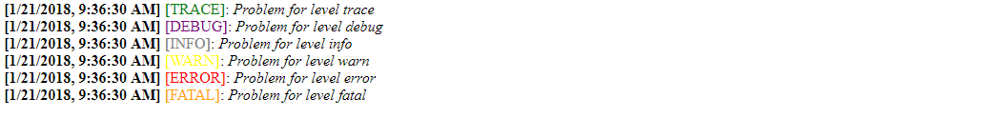

# Simple Logger Tracer npm nodeJS

A simple and easy Tracking log  for your project [FOR TRACKING YOUR SYSTEM ACTIONS :-P]

### Installing

Run:<br>
  ```cmd
    npm install
  ```
## Usage
  There is many tracking level of logging, try theese examples:
```javascript
  var klog = new Kennylog();
  klog.trace("A log for level trace");
  klog.debug("A log for level debug");
  klog.info("A log for level info");
  klog.warn("A log for level warn");
  klog.error("A log for level error");
  klog.fatal("A log for level fatal");
```
OR when you are doing a try - catch:
```javascript
  try {
    console.log(asdasd); // A variable not set
  } catch(e) {
    klog.error(e.stack);
  }
```
## How to test it
  ```cmd
    cd /path/to/thedownload/project
    node demo.js
  ```

## Dependencies
  Only 2 dependencies
  ```cmd
      fs 
      createIfNotExist 
  ```
## What is done?
  
  In your */log* directory, Kennylog will store *each daily logs* of the system life, and track anything.

## What you can get?
  ```shell
    > [1-21-2018, 12:56:23 AM] [TRACE]: Example of logging something with level trace
    > [1-21-2018, 12:56:23 AM] [ERROR]: ReferenceError: asdasd is not defined at Object
  ```
## The render:
  
  
## Why use this?

  I assumes, there is a lot of kind of tracers for nodeJS, but, this is the best you can use because, you know exactly how you can personnalize it for your project and it's need only *2 dependencies*
  
## Authors

* **Sanix Darker**

## Acknowledgments

* Hat tip to anyone who's code was used
* Inspiration
* etc...
